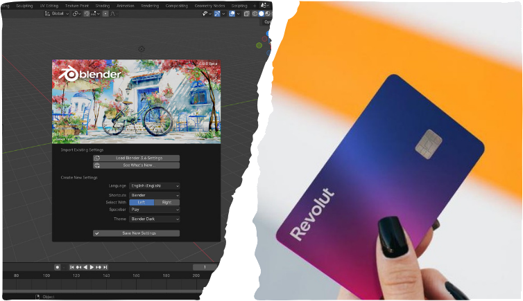
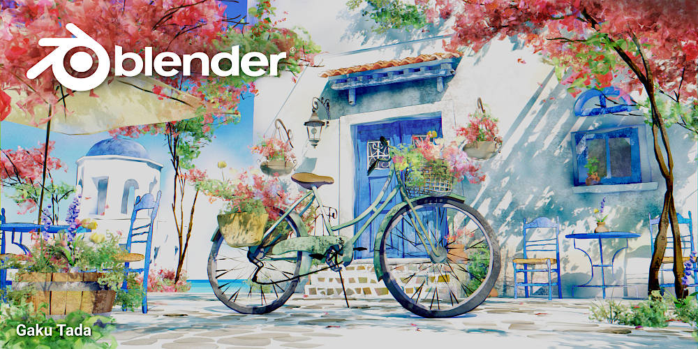
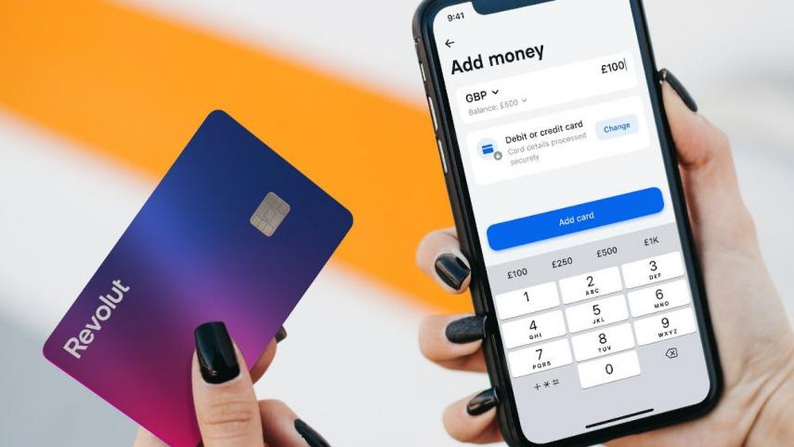

# PEC3: Visionando el futuro con las gafas de Manovich

**Autor:** Alejandro de la Torre Barón

**Fecha:** 06/12/2023

## Planteamiento

En el mundo actual, la hibridación es un fenómeno importante que está cambiando muchas cosas, entre ellos se encuentra la creatividad digital y también industria financiera. En la epxosición de este ensayo examinaremos cómo Blender permite la fusión de elementos bidimensionales y tridimensionales en el diseño gráfico y la animación al facilitar la hibridación de técnicas y medios. Por otro lado, examinaremos detalladamente a Revolut para analizar cómo esta plataforma fintech adopta la hibridación financiera al fusionar una variedad de servicios para ofrecer soluciones integrales en un paisaje tecnológico que evoluciona rápidamente. El enfoque de ambas investigaciones se centrará en la esencia de la hibridación y cómo redefine la experiencia financiera y la creatividad en la era digital.

## Re-descubriendo la hibridación: Blender

### Introducción

En la era digital, la hibridación ha surgido como una idea clave para comprender el desarrollo de los medios y su impacto en la cultura moderna. Este ensayo examinará el concepto de hibridación, con un énfasis particular en cómo se manifiesta en Blender, una herramienta potente que combina una variedad de medios y enfoques. Nos sumergiremos en el mundo de Blender para examinar cómo esta plataforma ejemplifica la hibridación al mezclar cualidades y técnicas distintivas de diversos medios, todo ello siguiendo las pautas del profesor y las observaciones de Lev Manovich.

#### ¿Qué es Blender?

Blender es un programa informático multiplataforma, gratuito y de código abierto, dedicado especialmente al modelado, iluminación, renderizado, la animación y creación de gráficos tridimensionales. También de composición digital utilizando la técnica procesal de nodos, edición de vídeo, escultura y pintura digital.

Blender es una herramienta versátil que se utiliza en una amplia gama de aplicaciones, incluyendo:

- Animación: Se utiliza para crear animaciones 3D para películas, televisión, videojuegos y otros medios.
- Modelado: Se utiliza para crear modelos 3D de objetos y entornos para la animación, el renderizado, la impresión 3D y otros propósitos.
- Iluminación y renderizado: Se utiliza para crear efectos de iluminación y renderizar imágenes 3D fotorrealistas.
- Composición digital: Se utiliza para crear composiciones digitales de imágenes y vídeos 2D y 3D.
- Edición de vídeo: Se utiliza para editar vídeos 2D y 3D.
- Escultura: Se utiliza para crear modelos 3D esculpidos.
- Pintura digital: Se utiliza para crear pinturas digitales.

Blender es una herramienta poderosa que puede utilizarse para crear una amplia gama de contenidos 3D. Es una opción gratuita y de código abierto que es una buena opción para artistas, animadores, diseñadores y creadores de contenido.

#### Significado de la hibridación según Manovich

> Lev Manovich, en su obra seminal, nos introduce a la hibridación como la nueva evolución del metamedio ordenador. En este contexto, la hibridación se manifiesta cuando las propiedades y técnicas exclusivas de diferentes medios se convierten en elementos de software que pueden combinarse de maneras antes inimaginables (Lev Manovich, 2013, p.183).

Es crucial darse cuenta de que la hibridación implica más que simplemente colocar componentes uno al lado del otro; también implica fusionar diferentes medios para
crear algo completamente nuevo.

### **Diversas técnicas de medios en Blender**

> Cuando en el caso de Blender, la hibridación se revela en el encuentro de diversas técnicas que previamente pertenecían a medios distintos (Lev Manovich, 2013, p.201).

La herramienta funciona como un lienzo digital donde las dimensiones se mezclan, se combinan lo bidimensional con lo tridimensional y se difuminan las líneas que separan el modelado 3D, la animación y la fotografía. Como sugiere Manovich, nos centraremos en el procesamiento de datos y la interfaz de usuario para encontrar instancias de hibridación en Blender.

#### **Hibridación de datos en Blender**

Blender nos facilita la hibridación de datos mediante la integración de técnicas como la fusión de 2D con 3D. Esto hace que Blender sea único en el espacio de la hibridación de datos. Hay nuevas formas de representar el mundo cuando se pueden manipular objetos tridimensionales en un entorno bidimensional. Blender facilita la convergencia de técnicas que antes estaban confinadas a diferentes dominios mediáticos, desde el diseño de escenas complejas hasta la combinación de elementos en entornos virtuales.

#### **Interfaz de usuario como espacio de hibridación**

Otro aspecto crucial de la hibridación en Blender se manifiesta en su interfaz de usuario. La herramienta ofrece diversas formas de interactuar y explorar el medio, creando un entorno propicio para la hibridación. Blender proporciona una plataforma donde los artistas digitales pueden explorar los límites entre las interfaces tradicionales unidimensionales y la convergencia de técnicas de modelado, animación y diseño gráfico.

#### **Ejemplos prácticos de hibridación en Blender**

Examinaremos ejemplos prácticos de hibridación en Blender para ayudar a clarificar las ideas abordadas. Se observará cómo Blender se convierte en un catalizador para la convergencia de medios, desde proyectos creativos que combinan modelos 3D con elementos fotográficos hasta aplicaciones interactivas que aprovechan las capacidades de Blender para crear experiencias inmersivas. Voy a exponer 5 ejemplos que son los siguientes:

- **Animación en 2D con Elementos 3D**: Blender permite la creación de animaciones bidimensionales combinadas con elementos tridimensionales. Puedes animar personajes dibujados en 2D sobre un fondo 3D, generando una hibridación que une la simplicidad del dibujo con la profundidad tridimensional.
- **Modelado 3D en Fotografía**: La integración de objetos 3D en fotografías reales es una forma efectiva de hibridación en Blender. Por ejemplo, se puede modelar un producto en 3D y luego integrarlo de manera realista en una fotografía, permitiendo una representación precisa y detallada.
- **Simulación de Fluidos en Entornos Reales**: Blender cuenta con herramientas de simulación de fluidos que pueden hibridar con entornos grabados en la vida real. Imaginemos una animación donde el agua simulada fluye naturalmente alrededor de objetos filmados, creando una fusión de elementos reales y generados por computadora.
- **Hibridación de Caracteres en Videojuegos**: En el ámbito de los videojuegos, Blender lo podemos utilizar para crear personajes y entornos 3D que luego se integran en motores de juego. Esto representa una hibridación donde los elementos generados en Blender se combinan con el motor de juego para ofrecer experiencias inmersivas y visuales.
- **Hibridación de Efectos Especiales en Producción Cinematográfica**: Se utiliza para crear efectos visuales y gráficos por computadora en producciones cinematográficas. La herramienta permite la integración de elementos generados por computadora, como criaturas fantásticas o entornos extraterrestres, en películas rodadas con actores reales.
- **Composición de Vídeo en Tiempo Real**: Blender puede hibridar en tiempo real, permitiendo la composición de videos en vivo con elementos 3D. Esto es particularmente útil en transmisiones en vivo o eventos en los que se desea incorporar gráficos generados por computadora de manera dinámica.
- **Creación de Entornos Virtuales para Realidad Aumentada**: Se utiliza para diseñar entornos 3D que luego se integran en aplicaciones de realidad aumentada. Puedes crear modelos 3D y escenarios virtuales que se superponen al mundo real a través de dispositivos AR, logrando así una hibridación entre lo digital y lo físico.

### **Conclusión**

En resumen, el proceso de hibridación en Blender se revela como una fusión artística de diversos medios digitales. Blender, al abrazar la manipulación de datos y redefinir la interfaz de usuario, es un ejemplo destacado de cómo la tecnología puede mejorar la hibridación en la cultura digital. La combinación de lo bidimensional con lo tridimensional no solo abre nuevas posibilidades creativas, sino que también cambia nuestra percepción de la representación digital. En última instancia, Blender sirve como algo más que una herramienta para diseñadores; es un espacio donde convergen y se entrelazan diversos lenguajes mediáticos para crear nuevas narrativas visuales en la era de la hibridación digital.

## Re-descubriendo la hibridación: Revolut

### Introducción

Revolut es un ejemplo destacado de un paradigma de hibridación en la revolución digital que ha transformado por completo nuestra forma de concebir las finanzas. Este ensayo examinará cómo Revolut combina diferentes servicios financieros y tecnologías para crear un ecosistema flexible que redefine cómo interactuamos con el dinero en la era digital.

**¿Qué es Revolut?**

Revolut es una plataforma fintech fundada en 2015 que redefine los servicios financieros tradicionales. Con enfoque en la flexibilidad y la eliminación de fronteras, ofrece servicios como pagos internacionales sin comisiones, cambio de divisas en tiempo real e innovadoras soluciones de inversión, todo integrado en una aplicación centrada en el usuario. Su enfoque híbrido ha hecho que Revolut sea una opción popular en la revolución de las finanzas digitales.

### **Hibridación de servicios financieros**

Revolut es un ejemplo destacado de hibridación, ya que unifica varios servicios financieros en una sola plataforma. Al integrar funciones que tradicionalmente requerían numerosos intermediarios financieros, la plataforma desafía la convención y ofrece servicios como el cambio de divisas en tiempo real y pagos internacionales. La capacidad de Revolut para proporcionar soluciones integrales con una experiencia de usuario unificada es claramente híbrida.

#### **Integración tecnológica y agilidad**

En Revolut, la hibridación abarca más que simplemente combinar servicios financieros; también incluye la integración de tecnologías de vanguardia. La integración de factores financieros y tecnológicos se demuestra mediante características como la emisión rápida de tarjetas, la automatización de inversiones y la inteligencia artificial para el análisis de gastos. Revolut es un lugar donde la creatividad y la agilidad se unen para ofrecer servicios financieros más efectivos.

#### **Democratización financiera a través de la hibridación**

A través de la provisión de servicios sin fronteras y la eliminación o reducción de tarifas tradicionales, Revolut ha derribado obstáculos para el acceso financiero. La mayor inclusividad resulta de la hibridación de servicios financieros, permitiendo que personas y empresas aprovechen al máximo las oportunidades globales. La plataforma facilita transacciones y fomenta la participación activa en la economía global al actuar como un vínculo entre diversos sistemas financieros.

#### **Desafíos éticos y regulatorios en la hibridación**

Revolut presenta dificultades éticas y regulatorias a medida que transforma el sector financiero. La seguridad de los datos, la privacidad y la necesidad de legislación adecuada son algunos de los problemas planteados por la hibridación de servicios financieros y la adopción de tecnologías emergentes. Esta parte del análisis invita a reflexionar sobre cómo equilibrar la innovación con la protección de los usuarios y la integridad del sistema financiero.

#### **Ejemplos prácticos de hibridación en Revolut**

- **Pagos internacionales y conversión de divisas en tiempo real**: Permite a los usuarios realizar pagos internacionales sin comisiones y cambiar monedas al tipo de cambio interbancario en tiempo real, eliminando la necesidad de utilizar servicios separados para estas funciones.
- **Inteligencia artificial para análisis de gastos**: Los usuarios pueden recibir insights automáticos sobre sus hábitos de gasto, categorizar transacciones y recibir sugerencias personalizadas, fusionando capacidades financieras con análisis de datos avanzado.
- **Emisión instantánea de tarjetas virtuales y físicas**: Los usuarios pueden generar tarjetas virtuales para compras en línea seguras y recibir tarjetas físicas en cuestión de minutos, fusionando la flexibilidad digital con la accesibilidad tradicional.
- **Automatización de inversiones**: Permite a los usuarios automatizar estrategias de inversión, diversificar carteras y acceder a opciones de inversión sin la necesidad de plataformas separadas de gestión de inversiones.
- **Eliminación de fronteras y tarifas**: Los usuarios pueden realizar transacciones internacionales y acceder a servicios financieros sin preocuparse por costos excesivos, eliminando las barreras tradicionales y fomentando la inclusión financiera a nivel global.
- **Criptomonedas y finanzas tradicionales**: Permite a los usuarios comprar, vender y mantener criptomonedas junto con monedas fiduciarias, ofreciendo una experiencia financiera que combina lo tradicional con lo emergente.

### **Conclusiones**

Como se ha podido comprobar, Revolut es una clara ilustración de la hibridación en la era digital, además de representar un avance en los servicios financieros. La plataforma redefine nuestra comprensión de la intersección entre tecnología y finanzas, al tiempo que simplifica las transacciones mediante la combinación de tecnologías innovadoras y diversas actividades financieras. En última instancia, Revolut está a la vanguardia de la hibridación financiera, instándonos a considerar las oportunidades que ofrece, así como los problemas éticos y legales que deben resolverse para garantizar un futuro financiero justo y sostenible.

## Referencias y Bibliografía

* Wikipedia (2023) [en línea]. “Blender” [Consulta: 6 de diciembre de 2023] <https://es.wikipedia.org/wiki/Blender>
* Ferran Adell (2023) [en línea]. “ Remediación, multimedia e hibridación de los medios” [Consulta: 6 de diciembre de 2023] <http://multimedia.uoc.edu/blogs/fem/es/remediacio-multimedia-i-hibridacio-dels-mitjans/>
* Jordi Alberich-Pascual (2018) [en línea]. “Elementos de la creatividad multimedia: apropiación, remediación, hibridación” [Consulta: 6 de diciembre de 2023] <https://mosaic.uoc.edu/author/jordi-alberich-pascual/>
* Lev Manovich (2013). “El software toma el mando”. UOCpress comunicación #29
* Wikipedia (2023) [en línea]. “Revolut” [Consulta: 6 de diciembre de 2023] <https://es.wikipedia.org/wiki/Revolut>
* The Economist (2023) [en línea]. “ The Future of Finance” [Consulta: 6 de diciembre de 2023] <https://www.economist.com/leaders/2015/05/09/the-fintech-revolution>
* [Forbes](https://mosaic.uoc.edu/author/jordi-alberich-pascual/) (2022) [en línea]. “How a Fintech Startup is Disrupting the Banking Industry” [Consulta: 6 de diciembre de 2023] <https://thefinancialbrand.com/news/fintech-banking/the-top-11-fintech-disruptors-of-2021-116705/>
* Capgemini (2022) [en línea]. “The Rise of Fintech: How Technology is Disrupting the Financial Services Industry” [Consulta: 6 de diciembre de 2023] <https://www.linkedin.com/pulse/fintech-evolution-disruption-financial-services-silva-mba-pmp>
* World Economic Forum (2022) [en línea]. “The Democratization of Financial Services” [Consulta: 6 de diciembre de 2023] <https://www.weforum.org/agenda/2022/05/what-i-learned-davos2022-financial-futures-expert/>
* Financial Times (2022) [en línea]. “The Ethical and Regulatory Challenges of Fintech” [Consulta: 6 de diciembre de 2023] <https://enterprise.ft.com/en-gb/blog/what-are-regulatory-challenges-facing-uk-fintechs/>

